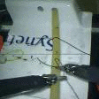

# Surgical-Skill-Assessment-via-Video-Semantic-Aggregation
Code for Surgical Skill Assessment via Video Semantic Aggregation (MICCAI 2022).

### Introduction
We propose a framework, **Vi**deo **S**emantic **A**ggregation (ViSA) for surgical skill assessment, which discovers different semantic parts and aggregates them across spatiotemporal dimensions. The explicit discovery of semantic parts provides an explanatory visualization that helps understand the neural network's decisions. It also enables us to further incorporate auxiliary information such as the kinematic data to improve representation learning and performance. The experiments on simulated datasets JIGSAWS and in-vivo dataset Hei-Chole show the competitiveness of ViSA compared to state-of-the-art methods. 


### Results
ViSA is able to quantify surgical skills from video by explicitly grouping video parts according to semantic clues (e.g., tools, tissue and background), and modeling the temporal relationship for different parts separately. As shown below, ViSA succeeds to separate the video parts having different semantics and track them across time. 

| Frame | Assignment Maps |
| --- | --- |
|  |  |
| |  |
| |  |

### Data Preparations
Download the dataset and link your data to the directories: ./data/jigsaws and ./data/hei-chole

JIGSAWS dataset is available from the [offical site](https://cirl.lcsr.jhu.edu/research/hmm/datasets/jigsaws_release/).

Hei-Chole data was downloaded from the [EndoVis Challenge in MICCAI 2019](https://endovissub-workflowandskill.grand-challenge.org/Data/). We sampled frames in 5 fps and reshaped them of width 160. We save the data like:

```
    .
    +---hei-chole
        +---annotations
        |   +---Skill
                +---Hei-Chole1_Calot_Skill.csv
                +---Hei-Chole1_Dissection_Skill.csv
                +---Hei-Chole1_Skill.csv
                .
                .
        +---frames
        |   +---5fps_160w
                +---Hei-Chole1_Calot
                    +---img_00000.jpg
                    +---img_00001.jpg
                    .
                    .
                +---Hei-Chole1_Dissection
                    +---img_00000.jpg
                    +---img_00001.jpg
                    .
                    .
                +---Hei-Chole2_Calot
                +---Hei-Chole2_Dissection
        .
        .
        .
```

### Code Running
```bash
# JIGSAWS
python main_jigsaws_group.py --split_index 0 --num_samples 32 --batch_size 4 --val_split SuperTrialOut --task Suturing --num_epochs 40 --schedule_step 20 --learning_rate 3e-5 --num_parts 3 --shaping_weight 10 --scene_node #--visualize

# Hei-Chole
python main_heichole_group.py --split_index 0 --num_samples 64 --batch_size 2 --task Across --num_epochs 40 --schedule_step 20 --learning_rate 3e-5 --num_parts 3 --shaping_weight 10 --scene_node --freeze_extractor #--visualize 
```


### Reference
```
@article{li2022surgical,
  title={Surgical Skill Assessment via Video Semantic Aggregation},
  author={Li, Zhenqiang and Gu, Lin and Wang, Weimin and Nakamura, Ryosuke and Sato, Yoichi},
  journal={arXiv preprint arXiv:2208.02611},
  year={2022}
}
```
